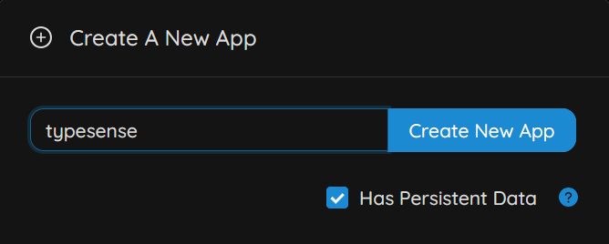
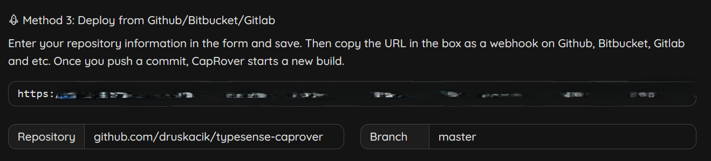
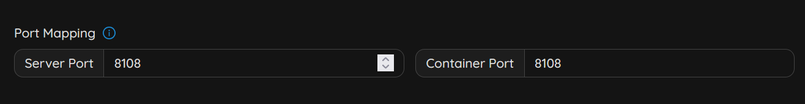
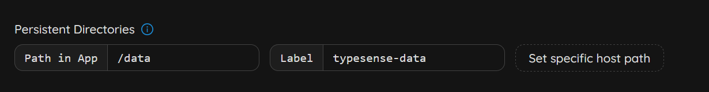

# Setting up Typesense server on Caprover

## 1. Create new app with persistent storage



## 2. Use this GitHub repository as deployment source



## 3. Set environment variables

In *App Configs*:

```
TYPESENSE_DATA_DIR=data
TYPESENSE_API_KEY=
```

## 4. Set port mapping

In Caprover app settings, set port mapping from `8108` to `8108`.



To check if the server is running properly, call:

```
curl http://{YOUR_SERVER_IP}:8108/health
```

## 5. Set persistent storage

To prevent data from getting deleted, set `/data` folder as a persistent directory.

